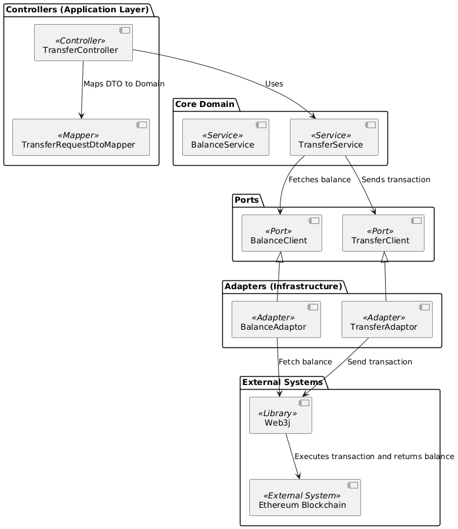
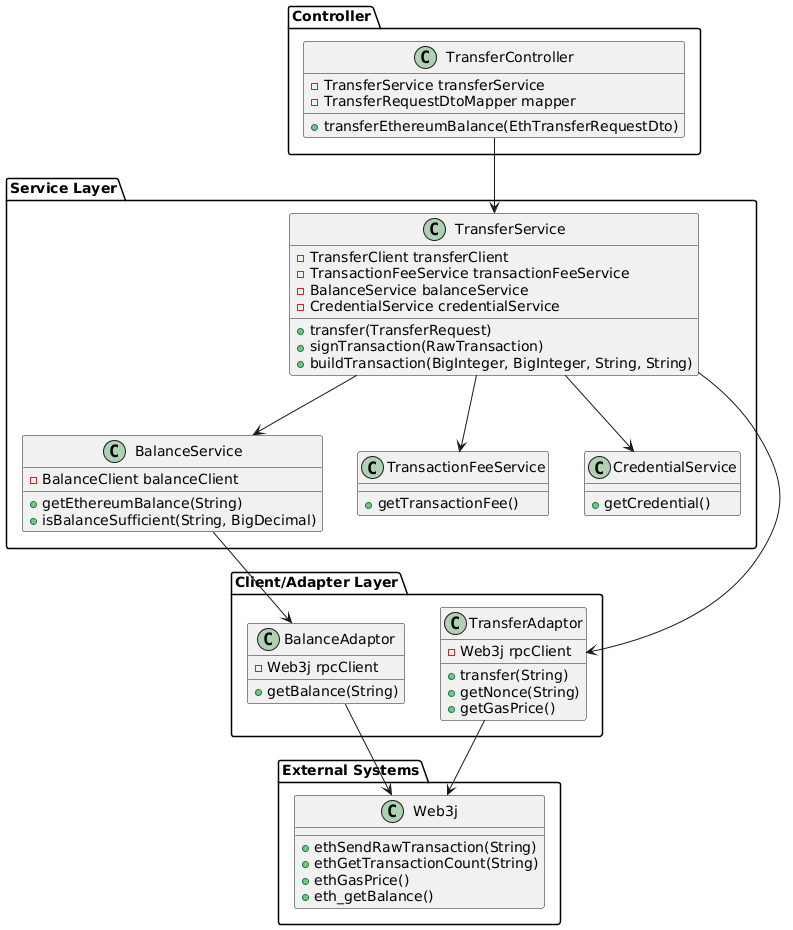
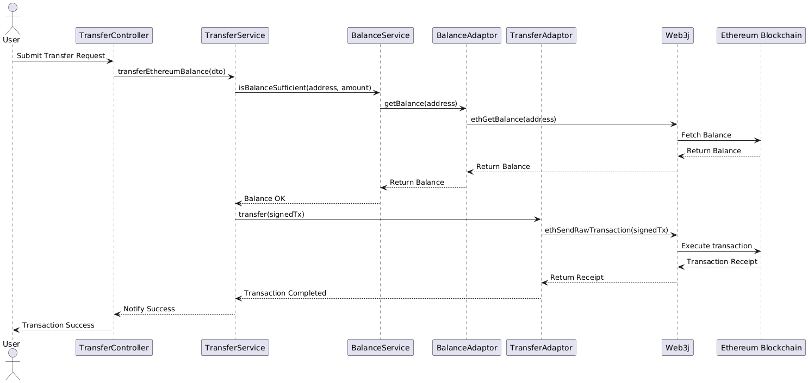
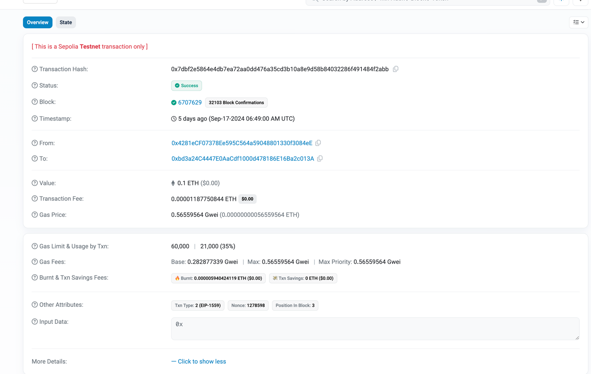

[](https://sonarcloud.io/summary/new_code?id=Puneethkumarck_crypto-api)
[](https://sonarcloud.io/summary/new_code?id=Puneethkumarck_crypto-api)
[](https://sonarcloud.io/summary/new_code?id=Puneethkumarck_crypto-api)
[](https://sonarcloud.io/summary/new_code?id=Puneethkumarck_crypto-api)

[](https://railway.app/template/aYpw1-?referralCode=F4Yi_e)
# Crypto API

The Crypto API provides seamless interaction with the Solana blockchain, allowing users to check balances, transfer SOL tokens, and handle airdrops in the event of insufficient funds.

## Table of Contents
- [Key Features](#key-features)
- [Technologies Used](#technologies-used)
- [Transfer SOL Flow](#transfer-sol-flow)
  - [Components](#components)
  - [System Diagram](#system-diagram)
  - [Sequence Diagram](#sequence-diagram)
- [Transfer Ethereum Flow](#transfer-ethereum-flow)
  - [Components](#components)
  - [System Diagram](#system-diagram)
  - [Sequence Diagram](#sequence-diagram)
- [Running the Application](#running-the-application)
- [Testing the API](#testing-the-api)
  - [Get Balance](#1-get-balance)
  - [Transfer SOL](#2-transfer-sol)
  - [Transfer Ethereum](#3-transfer-ethereum)
- [Blockchain Transaction Details](#blockchain-transaction-details)
- [Deployed Application](#deployed-application)


## Key Features
- **Check Balance**: Retrieve the SOL balance for any Solana wallet.
- **Transfer SOL**: Transfer SOL between two wallets with automatic validation and SOL airdrop for insufficient funds.
  - Both sender and receiver balances are checked.
  - If funds are insufficient, an airdrop is automatically initiated to complete the transaction.

## Technologies Used
- **Java 21**: Leveraging the latest features for performance and scalability.
- **Spring Boot 3.3.3**: Simplifies building production-ready applications.
- **Hexagonal Architecture**: Clean separation between core logic and infrastructure for better maintainability.
- **WireMock**: For mocking API interactions during tests.
- **SpringDoc OpenAPI**: Auto-generates OpenAPI documentation for improved API interoperability.
- **GitHub Actions**: CI/CD pipelines for automated testing and quality analysis.
- **SonarCloud**: Ensures code quality and security with continuous static analysis.
- **Codacy**: Provides additional insights into code quality.

## Transfer SOL Flow

### Components


### System Diagram
The diagram below illustrates the interaction between components within the hexagonal architecture for SOL transfers.


### Sequence Diagram
This diagram details the sequence of operations that occur during a SOL transfer.


## Transfer Ethereum Flow

### Components
The Ethereum transfer system uses the following components:
- **TransferController**: Handles requests for Ethereum balance transfers.
- **TransferService**: Executes the business logic for transferring Ethereum, including balance checks and signing transactions.
- **BalanceAdaptor**: Fetches the Ethereum balance of the sender.
- **TransferAdaptor**: Sends signed Ethereum transactions to the blockchain via Web3j.



### Class Diagram
This system diagram illustrates the interaction of components during an Ethereum transfer in a Hexagonal Architecture model.



### Sequence Diagram
The sequence diagram below details the steps for an Ethereum transfer, including address validation, balance checks, and sending the transaction.



## Running the Application
To run the Crypto API locally, use the following Gradle command:

```bash
./gradlew :app:bootRun
```
# Testing the API

You can test the API functionality using curl commands as shown below.

## 1. Get Balance
To fetch the balance of a Solana wallet, use the following command:

```bash
curl --location 'http://localhost:8080/api/v1/balances/p8guAeE7naqQcT2JMCp8Q376MLyzt5XynfGw3uCHM75'
```

## 2. Transfer SOL

To transfer SOL between two wallets, use the following command:

```bash
curl --location 'http://localhost:8080/api/v1/transfers' \
--header 'Content-Type: application/json' \
--data '{
"to" : "81e58SU8EHdBmSnETExsCwurbfWeCbNg9UoAFmKPyyj3",
"amount" : "1000"
}'
```
This will initiate a transfer of 1000 lamports to the specified wallet address.

## 3.Transfer Ethereum

```bash
curl --location 'http://localhost:8080/api/v1/transfers' \
--header 'Content-Type: application/json' \
--data '{
"to" : "0x5d940f3947c4ab1fbdbf1f540a10019931065f7a",
"amount" : "0.05"
}'
```

## Verifying the Transaction

### Solana Transaction

Once the transfer has been made, capture the **transaction signature** from the logs.

To verify the transaction:

1. Go to [Solana Explorer](https://explorer.solana.com/).
2. Paste the transaction signature into the search bar.
3. Press Enter to view the transaction details and confirm the transfer status.


## Solana Transaction Details

### Signature
- **5xRDwYsgDLMXpkkYLXbvmB66c4ENq9cgZue3S2Fo38FSnf6tCB8VDFNGL77gvRhADX2wzULVwcsCE59ZzyHm7TAZ**
  - This is the unique transaction identifier, known as the **transaction signature**. It's similar to a receipt ID that you can use to look up and verify the transaction on Solana Explorer.

### Result
- **Success**
  - Indicates that the transaction was successfully processed.

### Timestamp
- **Sep 13, 2024 at 14:44:20 Central European Summer Time**
  - The exact date and time when the transaction was confirmed on the Solana blockchain, in the specified time zone.

### Confirmation Status
- **finalized**
  - This means that the transaction has been permanently included in the blockchain, and all nodes have agreed upon its validity.

### Confirmations
- **max**
  - Indicates that the transaction has the maximum number of confirmations possible, ensuring it is fully validated.

### Slot
- **325,730,164**
  - A **slot** is a period during which a validator can propose a block. This is the slot number where your transaction was included.

### Recent Blockhash
- **7DDLsppuoykdpJ168HgZAztzheN9Gehn43BSMCyQBohs**
  - The blockhash used for this transaction, which ensures that it was included in a specific block of the blockchain. Each transaction is tied to a recent blockhash to prevent replay attacks.

### Fee (SOL)
- **◎0.000005**
  - The transaction fee paid for processing the transaction on the Solana blockchain, in SOL. The symbol "◎" is commonly used to denote SOL.

### Compute Units Consumed
- **150**
  - This represents the amount of computational resources (in units) consumed to process the transaction. More complex transactions may consume more units.

### Transaction Version
- **legacy**
  - Refers to the version of the Solana transaction format being used. In this case, it's the "legacy" version.

---

### Account Input(s)
This section shows the Solana accounts involved in the transaction and how their balances changed.

1. **p8guAeE7naqQcT2JMCp8Q376MLyzt5XynfGw3uCHM75**
- **Change (SOL):** -◎0.000006 (This account paid the fee for the transaction)
- **Post Balance (SOL):** ◎1.998435
- This is the **fee payer** for the transaction, and also the **sender** of the SOL in this transaction.

2. **81e58SU8EHdBmSnETExsCwurbfWeCbNg9UoAFmKPyyj3**
- **Change (SOL):** +◎0.000001
- **Post Balance (SOL):** ◎1.00078
- This is the **recipient** of the transferred SOL.

3. **System Program**
- This is the built-in Solana program used to handle basic tasks like transferring SOL between accounts.

---

### Instruction

1. **System Program: Transfer**
- This indicates that the transaction involved the **System Program** for transferring SOL.

- **From Address:** p8guAeE7naqQcT2JMCp8Q376MLyzt5XynfGw3uCHM75 (Sender)
- **To Address:** 81e58SU8EHdBmSnETExsCwurbfWeCbNg9UoAFmKPyyj3 (Recipient)
- **Transfer Amount (SOL):** ◎0.000001

- This instruction shows that 0.000001 SOL was transferred from the sender to the recipient.

---

### Program Instruction Logs
- **Program returned success**
  - The program responsible for handling the transaction (in this case, the System Program) returned successfully, meaning the transfer was executed without errors.

---
### Summary
- The transaction successfully transferred **0.000001 SOL** from the sender to the recipient.
- A transaction fee of **0.000005 SOL** was charged to the sender.
- The transaction was **finalized** and is now a permanent part of the Solana blockchain, confirmed at **slot 325,730,164**.

---
### Ethereum Transaction Details

After initiating an Ethereum transfer, you can verify the transaction on the Ethereum blockchain using the transaction hash.

capture the **transaction signature** from the logs.

To verify the transaction:

1. Go to [Ether Scan](https://sepolia.etherscan.io/).
2. Paste the transaction signature into the search bar.
3. Press Enter to view the transaction details and confirm the transfer status.



### Transaction Hash:
- **0x7dbf2e5864e4db7ea72aa0dd476a35cd3b10a8e9d58b84032286f491484f2abb**
  - This is the unique identifier for the transaction, which can be used to track and verify it on the Ethereum blockchain via a block explorer like [Etherscan](https://etherscan.io/tx/0x7dbf2e5864e4db7ea72aa0dd476a35cd3b10a8e9d58b84032286f491484f2abb).

### Status:
- **Success**
  - The transaction was processed successfully and is now included in the blockchain.

### Block:
- **6707629**
  - The transaction was included in this block on the Ethereum blockchain.
  - A **block** is a group of transactions that were confirmed and added to the blockchain.

### Block Confirmations:
- **32103 Block Confirmations**
  - The number of blocks that have been mined since the block containing this transaction. More confirmations make the transaction more secure and harder to reverse.

### Timestamp:
- **Sep-17-2024 06:49:00 AM UTC** (5 days ago)
  - This is the exact date and time when the transaction was included in the blockchain.

---

## Parties Involved

### From:
- **0x4281eCF07378Ee595C564a59048801330f3084eE**
  - This is the Ethereum address of the **sender** (the account that initiated the transaction and paid for the gas fees).

### To:
- **0xbd3a24C4447E0AaCdf1000d478186E16Ba2c013A**
  - This is the Ethereum address of the **recipient** (the account that received the funds).

---

## Transaction Details

### Value:
- **0.1 ETH**
  - The amount of Ether (ETH) transferred from the sender to the recipient. In this case, **0.1 ETH** was sent.
  - **USD Equivalent**: $0.00 (at the time of transaction)

### Transaction Fee:
- **0.00001187750844 ETH**
  - The total amount of gas fees paid by the sender to process the transaction.
  - **USD Equivalent**: $0.00 (at the time of transaction)

### Gas Price:
- **0.56559564 Gwei** (0.00000000056559564 ETH)
  - The price per unit of gas paid in Gwei. The **gas price** fluctuates based on network demand and determines how quickly miners will process the transaction.

### Gas Limit & Usage by Transaction:
- **Gas Limit**: 60,000
  - The maximum amount of gas units that the sender was willing to pay for this transaction.
- **Gas Used**: 21,000
  - The actual amount of gas consumed by the transaction, which was 35% of the gas limit.

---

## Gas Fees Breakdown

### Gas Fees:
- **Base Fee**: 0.282877339 Gwei
  - The base fee is the minimum amount of gas required for this transaction, set by the Ethereum network.
- **Max Fee**: 0.56559564 Gwei
  - The maximum gas fee the sender was willing to pay.
- **Max Priority Fee**: 0.56559564 Gwei
  - The maximum priority fee offered by the sender to incentivize miners to prioritize this transaction.

### Burnt & Transaction Savings Fees:
- 🔥 **Burnt**: 0.000005940424119 ETH
  - Under **EIP-1559**, part of the gas fee is burned (removed from circulation) to reduce Ethereum supply, making the network deflationary.
- 💸 **Transaction Savings**: 0 ETH
  - Any savings from unused gas.

---

## Other Transaction Attributes

### Transaction Type:
- **2 (EIP-1559)**
  - This transaction follows the **EIP-1559** standard, which introduced dynamic gas fees and the concept of gas burning.

### Nonce:
- **1278598**
  - The transaction nonce is a unique number associated with the sender's account. It represents the number of transactions sent from this address.

### Position in Block:
- **3**
  - The transaction was the 3rd transaction included in block **6707629**.

---

### Summary:
- **0.1 ETH** was successfully transferred from `0x4281eCF07378Ee595C564a59048801330f3084eE` to `0xbd3a24C4447E0AaCdf1000d478186E16Ba2c013A`.
- The transaction incurred a **fee of 0.00001187750844 ETH**.
- The transaction used **21,000 gas** out of a **60,000 gas limit**.
- **0.000005940424119 ETH** was burned as part of the EIP-1559 protocol.
- The transaction is securely confirmed with **32103 block confirmations**.


## Deployed Application
The application is deployed and accessible [here](https://crypto-api-production-473a.up.railway.app/swagger-ui/index.html).

### References
- [Solana Documentation](https://docs.solana.com/)
- [Solana Explorer](https://explorer.solana.com/)
- [Solana Whitepaper](https://solana.com/solana-whitepaper.pdf)
- [Ether Scan](https://sepolia.etherscan.io/)
- [Quicknode](https://www.quicknode.com/guides/solana-development/getting-started/solana-fundamentals-reference-guide)

