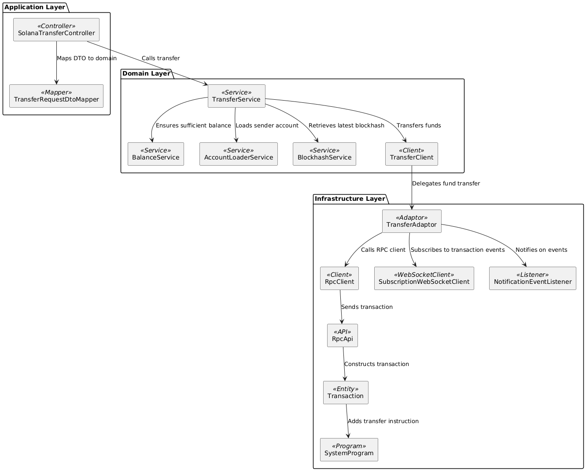
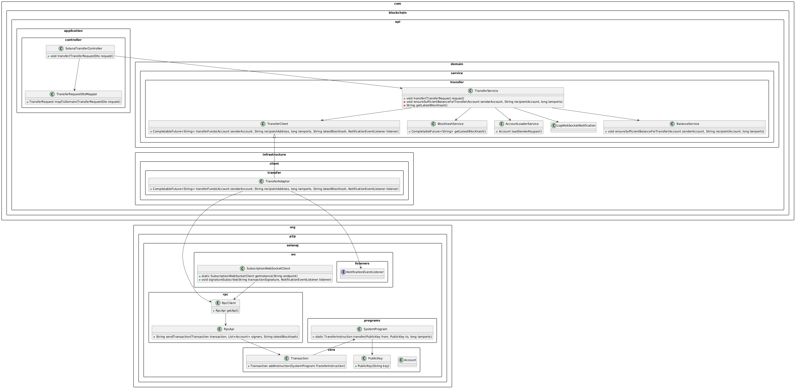
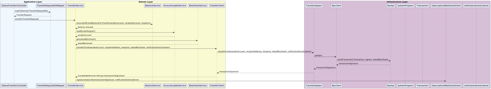

[](https://sonarcloud.io/summary/new_code?id=Puneethkumarck_crypto-api)
[](https://sonarcloud.io/summary/new_code?id=Puneethkumarck_crypto-api)
[](https://sonarcloud.io/summary/new_code?id=Puneethkumarck_crypto-api)
[](https://sonarcloud.io/summary/new_code?id=Puneethkumarck_crypto-api)

[](https://railway.app/template/aYpw1-?referralCode=F4Yi_e)
# Crypto API

The Crypto API provides seamless interaction with the Solana blockchain, allowing users to check balances, transfer SOL tokens, and handle airdrops in the event of insufficient funds.

## Table of Contents
- [Key Features](#key-features)
- [Technologies Used](#technologies-used)
- [Transfer SOL Flow](#transfer-sol-flow)
  - [Components](#components)
  - [System Diagram](#system-diagram)
  - [Sequence Diagram](#sequence-diagram)
- [Running the Application](#running-the-application)
- [Testing the API](#testing-the-api)
  - [Get Balance](#1-get-balance)
  - [Transfer SOL](#2-transfer-sol)
- [Solana Transaction Details](#solana-transaction-details)
- [Deployed Application](#deployed-application)


## Key Features
- **Check Balance**: Retrieve the SOL balance for any Solana wallet.
- **Transfer SOL**: Transfer SOL between two wallets with automatic validation and SOL airdrop for insufficient funds.
  - Both sender and receiver balances are checked.
  - If funds are insufficient, an airdrop is automatically initiated to complete the transaction.

## Technologies Used
- **Java 21**: Leveraging the latest features for performance and scalability.
- **Spring Boot 3.3.3**: Simplifies building production-ready applications.
- **Hexagonal Architecture**: Clean separation between core logic and infrastructure for better maintainability.
- **WireMock**: For mocking API interactions during tests.
- **SpringDoc OpenAPI**: Auto-generates OpenAPI documentation for improved API interoperability.
- **GitHub Actions**: CI/CD pipelines for automated testing and quality analysis.
- **SonarCloud**: Ensures code quality and security with continuous static analysis.
- **Codacy**: Provides additional insights into code quality.

## Transfer SOL Flow

### Components


### System Diagram
The diagram below illustrates the interaction between components within the hexagonal architecture for SOL transfers.



### Sequence Diagram
This diagram details the sequence of operations that occur during a SOL transfer.



## Running the Application
To run the Crypto API locally, use the following Gradle command:

```bash
./gradlew :app:bootRun
```
# Testing the API

You can test the API functionality using curl commands as shown below.

## 1. Get Balance
To fetch the balance of a Solana wallet, use the following command:

```bash
curl --location 'http://localhost:8080/api/v1/balances/p8guAeE7naqQcT2JMCp8Q376MLyzt5XynfGw3uCHM75'
```

## 2. Transfer SOL

To transfer SOL between two wallets, use the following command:

```bash
curl --location 'http://localhost:8080/api/v1/transfers' \
--header 'Content-Type: application/json' \
--data '{
"to" : "81e58SU8EHdBmSnETExsCwurbfWeCbNg9UoAFmKPyyj3",
"amount" : "1000"
}'
```
This will initiate a transfer of 1000 lamports to the specified wallet address.

## Verifying the Transaction

Once the transfer has been made, capture the **transaction signature** from the logs.

To verify the transaction:

1. Go to [Solana Explorer](https://explorer.solana.com/).
2. Paste the transaction signature into the search bar.
3. Press Enter to view the transaction details and confirm the transfer status.


## Solana Transaction Details

### Signature
- **5xRDwYsgDLMXpkkYLXbvmB66c4ENq9cgZue3S2Fo38FSnf6tCB8VDFNGL77gvRhADX2wzULVwcsCE59ZzyHm7TAZ**
  - This is the unique transaction identifier, known as the **transaction signature**. It's similar to a receipt ID that you can use to look up and verify the transaction on Solana Explorer.

### Result
- **Success**
  - Indicates that the transaction was successfully processed.

### Timestamp
- **Sep 13, 2024 at 14:44:20 Central European Summer Time**
  - The exact date and time when the transaction was confirmed on the Solana blockchain, in the specified time zone.

### Confirmation Status
- **finalized**
  - This means that the transaction has been permanently included in the blockchain, and all nodes have agreed upon its validity.

### Confirmations
- **max**
  - Indicates that the transaction has the maximum number of confirmations possible, ensuring it is fully validated.

### Slot
- **325,730,164**
  - A **slot** is a period during which a validator can propose a block. This is the slot number where your transaction was included.

### Recent Blockhash
- **7DDLsppuoykdpJ168HgZAztzheN9Gehn43BSMCyQBohs**
  - The blockhash used for this transaction, which ensures that it was included in a specific block of the blockchain. Each transaction is tied to a recent blockhash to prevent replay attacks.

### Fee (SOL)
- **◎0.000005**
  - The transaction fee paid for processing the transaction on the Solana blockchain, in SOL. The symbol "◎" is commonly used to denote SOL.

### Compute Units Consumed
- **150**
  - This represents the amount of computational resources (in units) consumed to process the transaction. More complex transactions may consume more units.

### Transaction Version
- **legacy**
  - Refers to the version of the Solana transaction format being used. In this case, it's the "legacy" version.

---

### Account Input(s)
This section shows the Solana accounts involved in the transaction and how their balances changed.

1. **p8guAeE7naqQcT2JMCp8Q376MLyzt5XynfGw3uCHM75**
- **Change (SOL):** -◎0.000006 (This account paid the fee for the transaction)
- **Post Balance (SOL):** ◎1.998435
- This is the **fee payer** for the transaction, and also the **sender** of the SOL in this transaction.

2. **81e58SU8EHdBmSnETExsCwurbfWeCbNg9UoAFmKPyyj3**
- **Change (SOL):** +◎0.000001
- **Post Balance (SOL):** ◎1.00078
- This is the **recipient** of the transferred SOL.

3. **System Program**
- This is the built-in Solana program used to handle basic tasks like transferring SOL between accounts.

---

### Instruction

1. **System Program: Transfer**
- This indicates that the transaction involved the **System Program** for transferring SOL.

- **From Address:** p8guAeE7naqQcT2JMCp8Q376MLyzt5XynfGw3uCHM75 (Sender)
- **To Address:** 81e58SU8EHdBmSnETExsCwurbfWeCbNg9UoAFmKPyyj3 (Recipient)
- **Transfer Amount (SOL):** ◎0.000001

- This instruction shows that 0.000001 SOL was transferred from the sender to the recipient.

---

### Program Instruction Logs
- **Program returned success**
  - The program responsible for handling the transaction (in this case, the System Program) returned successfully, meaning the transfer was executed without errors.

---
### Summary
- The transaction successfully transferred **0.000001 SOL** from the sender to the recipient.
- A transaction fee of **0.000005 SOL** was charged to the sender.
- The transaction was **finalized** and is now a permanent part of the Solana blockchain, confirmed at **slot 325,730,164**.

## Deployed Application
The application is deployed and accessible [here](https://crypto-api-production-473a.up.railway.app/swagger-ui/index.html).

### References
- [Solana Documentation](https://docs.solana.com/)
- [Solana Explorer](https://explorer.solana.com/)
- [Solana Whitepaper](https://solana.com/solana-whitepaper.pdf)
- [Quicknode](https://www.quicknode.com/guides/solana-development/getting-started/solana-fundamentals-reference-guide)

