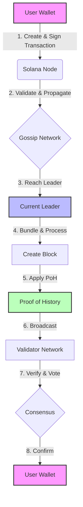

# Solana Transaction Flow: High Level E2E flow of transactions through the Solana network

Let's walk through the process of sending 1 SOL to your friend on the Solana network.

## 1. Creating the Transaction

You open your Solana wallet app and enter:
* Recipient: Your friend's wallet address
* Amount: 1 SOL

The app creates a transaction that includes:
* Instruction: "Transfer 1 SOL from my address to my friend's address"
* A recent blockhash: Like a timestamp to ensure the transaction is fresh
* Your signature: To prove it's really you making the transaction

```json
Transaction {
  instruction: "Transfer 1 SOL from ABC123... to XYZ789...",
  blockhash: "Recent123...",
  signature: "YourSignature456..."
}
```

## 2. Sending the Transaction

Your wallet app sends this transaction to a Solana node (think of it as a computer in the Solana network).

The node checks:
1. Is the signature valid?
2. Is the blockhash recent?
3. Do you have enough SOL?

If all checks pass, the node shares this transaction with other nodes.

## 3. Leader Selection

Solana has a schedule of which node (called a validator) will be the leader at each moment.

Let's say Validator Bob is the current leader. All nodes send your transaction to Bob.

## 4. Processing the Transaction

Bob receives your transaction and many others. He:
1. Bundles these transactions into a block
2. Processes each transaction in the block

For your transaction, Bob's computer:
* Subtracts 1 SOL from your account
* Adds 1 SOL to your friend's account

## 5. Proof of History and Consensus

As Bob processes transactions, he's also running a special clock called Proof of History (PoH).
It's like a super-fast stopwatch that puts a timestamp on every action.

Bob sends out the processed block with all its transactions and PoH timestamps.

Other validators check Bob's work:
* Did he process all transactions correctly?
* Do the PoH timestamps make sense?

If most validators agree Bob did a good job, your transaction is confirmed.

## 6. Confirmation

Your wallet app checks with the network and sees that your transaction is confirmed.
It shows you a message: "1 SOL sent successfully to your friend!"

Your friend's wallet balance increases by 1 SOL.

## Diagram



## Key Points:

1. Your transaction is bundled with others for efficiency.
2. One leader (validator) processes transactions at a time.
3. Other validators check the leader's work.
4. The unique PoH "clock" helps keep everything in order.
5. This process happens very fast - usually in less than a second!

